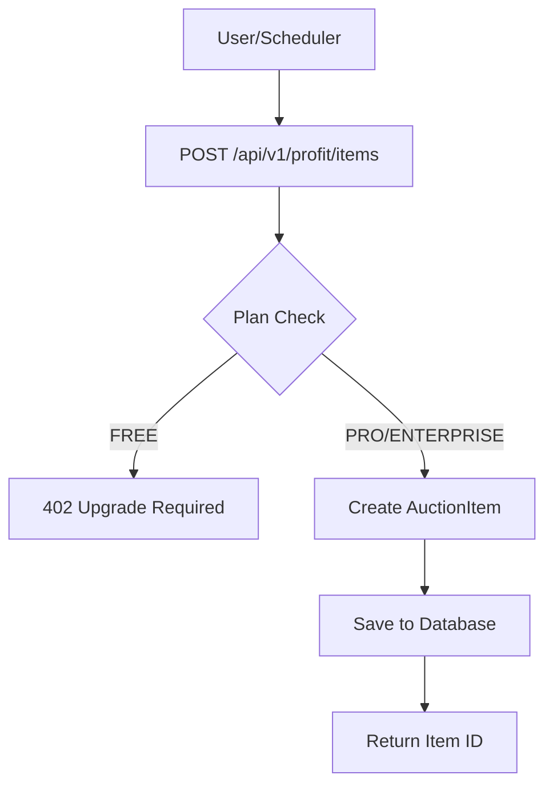

# Market Analysis Flow - Technical Workflow

**Version:** 1.0  
**Last Updated:** November 2, 2025

---

## ?? Overview

This document describes the step-by-step workflow of the Profit Advisor's market analysis system, from auction item creation to profit estimate delivery.

---

## ?? Complete Analysis Flow

### Stage 0: Auction Item Creation

**Trigger:** User creates auction item via API or nightly scheduler  
**Input:** Lot details (title, category, starting price, auction date)



**API Request:**
```json
POST /api/v1/profit/items
Authorization: Bearer {token}
X-Team-Id: 1

{
  "lot_id": "LOT-2025-1234",
  "title": "19th Century Silver Candleholder",
  "category": "silver",
  "starting_price": 800.0,
  "auction_date": "2025-11-10T14:00:00Z",
  "source": "Christie's Online"
}
```

**Database Insert:**
```sql
INSERT INTO auction_items (
    lot_id, title, category, starting_price, 
    auction_date, source, team_id, created_at
) VALUES (
    'LOT-2025-1234', '19th Century Silver Candleholder', 
    'silver', 800.0, '2025-11-10 14:00:00', 
    'Christie''s Online', 1, NOW()
);
```

---

### Stage 1: Analysis Trigger

**Triggers:**
1. **Manual:** User clicks "Refresh Analysis" button ? `POST /api/v1/profit/analyze`
2. **Automatic:** Nightly scheduler (03:00 AM) ? `ProfitAdvisorService.run_all_teams()`

```python
# Manual trigger
@router.post("/analyze")
async def analyze_items(
    request: AnalyzeRequest,
    team_context: TeamContext,
    db: Session
):
    check_profit_advisor_access(team_context)
    advisor = ProfitAdvisorService(db)
    estimates = await advisor.analyze_team_items(
        team_id=team_context.team.id,
        force_refresh=request.force_refresh
    )
    return estimates

# Nightly scheduler
@daily("03:00")
def run_daily_profit_analysis():
    with get_db_session() as db:
        advisor = ProfitAdvisorService(db)
        asyncio.run(advisor.run_all_teams())
```

---

### Stage 2: Item Selection & Caching Check

**ProfitAdvisorService.analyze_team_items()**

```python
async def analyze_team_items(self, team_id: int, force_refresh: bool = False):
    # 1. Get all upcoming auction items for team
    items = self.db.exec(
        select(AuctionItem)
        .where(AuctionItem.team_id == team_id)
        .where(AuctionItem.auction_date > datetime.utcnow())
        .order_by(AuctionItem.auction_date)
    ).all()
    
    # 2. Check for recent estimates (cache)
    estimates = []
    for item in items:
        if not force_refresh:
            existing = self._get_recent_estimate(item.id)
            if existing:
                estimates.append(existing)
                continue
        
        # 3. Analyze item
        estimate = await self.analyze_item(item, force_refresh)
        estimates.append(estimate)
    
    return estimates
```

**Cache Logic:**
```python
def _get_recent_estimate(self, auction_item_id: int) -> Optional[ProfitEstimate]:
    # Return estimate if created < 24 hours ago
    cutoff = datetime.utcnow() - timedelta(hours=24)
    return self.db.exec(
        select(ProfitEstimate)
        .where(ProfitEstimate.auction_item_id == auction_item_id)
        .where(ProfitEstimate.created_at > cutoff)
        .order_by(ProfitEstimate.created_at.desc())
    ).first()
```

---

### Stage 3: Market Data Fetching

**ProfitAdvisorService.analyze_item() ? MarketFetcher.fetch_all_sources()**

```python
async def analyze_item(self, auction_item: AuctionItem) -> ProfitEstimate:
    # Fetch market data from all sources concurrently
    market_data_list = await market_fetcher.fetch_all_sources(
        title=auction_item.title,
        category=auction_item.category
    )
    
    # Store market references in database
    for data in market_data_list:
        ref = MarketReference(
            auction_item_id=auction_item.id,
            source=data["source"],
            avg_price=data["market_avg"],
            sample_size=data["sample_size"],
            liquidity_score=data["liquidity_score"],
            last_checked=datetime.utcnow()
        )
        self.db.add(ref)
```

**MarketFetcher Concurrent Execution:**
```python
async def fetch_all_sources(self, title: str, category: str) -> List[Dict]:
    tasks = [
        self.fetch_market_data(title, category, "ebay"),
        self.fetch_market_data(title, category, "etsy"),
        self.fetch_market_data(title, category, "sahibinden"),
        self.fetch_market_data(title, category, "letgo")
    ]
    results = await asyncio.gather(*tasks)
    return results
```

**Per-Source Fetching:**
```python
async def fetch_market_data(
    self, title: str, category: str, source: str
) -> Dict[str, any]:
    # Simulate network delay
    await asyncio.sleep(random.uniform(0.1, 0.5))
    
    # Generate deterministic pseudo-random data
    seed = hash(f"{title}:{category}:{source}") % (2**32)
    rng = random.Random(seed)
    
    # Category-specific base price
    base_price = self.category_ranges.get(category, (100, 1000))
    market_avg = rng.uniform(base_price[0], base_price[1])
    
    # Source-specific multiplier
    multiplier = {
        "ebay": 1.0,
        "etsy": 1.15,
        "sahibinden": 0.85,
        "letgo": 0.80
    }[source]
    
    return {
        "source": source,
        "market_avg": round(market_avg * multiplier, 2),
        "sample_size": rng.randint(5, 50),
        "liquidity_score": rng.uniform(0.6, 0.95),
        "volatility_stability": rng.uniform(0.7, 0.9)
    }
```

**Example Output:**
```json
[
  {
    "source": "ebay",
    "market_avg": 1050.0,
    "sample_size": 28,
    "liquidity_score": 0.85,
    "volatility_stability": 0.82
  },
  {
    "source": "etsy",
    "market_avg": 1200.0,
    "sample_size": 12,
    "liquidity_score": 0.90,
    "volatility_stability": 0.88
  },
  {
    "source": "sahibinden",
    "market_avg": 950.0,
    "sample_size": 15,
    "liquidity_score": 0.75,
    "volatility_stability": 0.75
  },
  {
    "source": "letgo",
    "market_avg": 880.0,
    "sample_size": 8,
    "liquidity_score": 0.65,
    "volatility_stability": 0.70
  }
]
```

---

### Stage 4: Data Aggregation

**MarketFetcher.aggregate_market_data()**

```python
def aggregate_market_data(self, market_data_list: List[Dict]) -> Dict[str, float]:
    if not market_data_list:
        return {
            "avg_market_price": 0.0,
            "avg_liquidity": 0.0,
            "avg_volatility_stability": 0.0,
            "source_count": 0,
            "total_samples": 0
        }
    
    # Weighted average by sample size
    total_weighted_price = sum(
        d["market_avg"] * d["sample_size"] 
        for d in market_data_list
    )
    total_samples = sum(d["sample_size"] for d in market_data_list)
    
    avg_market_price = total_weighted_price / total_samples if total_samples > 0 else 0.0
    
    # Simple averages for liquidity and volatility
    avg_liquidity = sum(d["liquidity_score"] for d in market_data_list) / len(market_data_list)
    avg_volatility = sum(d["volatility_stability"] for d in market_data_list) / len(market_data_list)
    
    return {
        "avg_market_price": round(avg_market_price, 2),
        "avg_liquidity": round(avg_liquidity, 3),
        "avg_volatility_stability": round(avg_volatility, 3),
        "source_count": len(market_data_list),
        "total_samples": total_samples
    }
```

**Example Calculation:**
```
Input:
  eBay:       1050? ? 28 = 29,400
  Etsy:       1200? ? 12 = 14,400
  Sahibinden:  950? ? 15 = 14,250
  Letgo:       880? ?  8 =  7,040
  ????????????????????????????????
  Total:      65,090 / 63 = 1,033?

Output:
  avg_market_price: 1,033?
  avg_liquidity: 0.79
  avg_volatility_stability: 0.79
  source_count: 4
  total_samples: 63
```

---

### Stage 5: Profit Calculation

**ProfitAdvisorService._calculate_profit_metrics()**

```python
def _calculate_profit_metrics(
    self,
    auction_item: AuctionItem,
    aggregated_market_data: Dict[str, float]
) -> Dict[str, float]:
    market_avg = aggregated_market_data["avg_market_price"]
    starting_price = auction_item.starting_price
    
    # Target 15% ROI buffer
    recommended_max_bid = market_avg * 0.85
    
    # Ensure bid is above starting price
    if recommended_max_bid < starting_price:
        recommended_max_bid = starting_price * 1.05
    
    # Calculate profit
    profit_amount = market_avg - recommended_max_bid
    profit_margin = profit_amount / recommended_max_bid if recommended_max_bid > 0 else 0
    
    return {
        "estimated_value": market_avg,
        "recommended_max_bid": round(recommended_max_bid, 2),
        "profit_margin": round(profit_margin, 4),
        "profit_amount": round(profit_amount, 2)
    }
```

**Example:**
```
Input:
  market_avg = 1,033?
  starting_price = 800?

Calculation:
  recommended_max_bid = 1,033 ? 0.85 = 878?
  profit_amount = 1,033 - 878 = 155?
  profit_margin = 155 / 878 = 0.176 (17.6%)

Output:
  estimated_value: 1,033?
  recommended_max_bid: 878?
  profit_margin: 0.176
  profit_amount: 155?
```

---

### Stage 6: Confidence Scoring

**ProfitAdvisorService._calculate_confidence()**

```python
def _calculate_confidence(
    self,
    aggregated_market_data: Dict[str, float],
    profit_metrics: Dict[str, float]
) -> float:
    liquidity = aggregated_market_data["avg_liquidity"]
    volatility_stability = aggregated_market_data["avg_volatility_stability"]
    sample_size = aggregated_market_data["total_samples"]
    source_count = aggregated_market_data["source_count"]
    
    # Normalize sample size (0-1 scale, max at 100 samples)
    sample_norm = min(sample_size / 100, 1.0)
    
    # Weighted confidence score
    confidence = (
        liquidity * 0.35 +
        volatility_stability * 0.30 +
        sample_norm * 0.20 +
        0.0 * 0.15  # Visual match (future implementation)
    )
    
    # Boost for multi-source agreement
    if source_count >= 3:
        confidence = min(confidence * 1.1, 1.0)
    
    # Penalty for low profit margin
    if profit_metrics["profit_margin"] < 0.05:
        confidence *= 0.9
    
    return round(max(0, min(confidence, 1.0)), 3)
```

**Example:**
```
Input:
  liquidity = 0.79
  volatility_stability = 0.79
  sample_size = 63
  source_count = 4
  profit_margin = 0.176

Calculation:
  sample_norm = min(63 / 100, 1.0) = 0.63
  
  confidence = (
    0.79 ? 0.35 +
    0.79 ? 0.30 +
    0.63 ? 0.20 +
    0.0  ? 0.15
  ) = 0.640
  
  # Multi-source boost
  confidence = 0.640 ? 1.1 = 0.704
  
  # No low-margin penalty (0.176 > 0.05)

Output: 0.704 (70.4%)
```

---

### Stage 7: Risk Assessment

**ProfitAdvisorService._determine_risk_level()**

```python
def _determine_risk_level(
    self,
    confidence: float,
    profit_margin: float,
    market_volatility: float
) -> str:
    # LOW: High confidence + good margin + low volatility
    if confidence >= 0.8 and profit_margin >= 0.15 and market_volatility < 0.3:
        return "low"
    
    # HIGH: Low confidence or bad margin
    elif confidence < 0.6 or profit_margin < 0.05:
        return "high"
    
    # MEDIUM: Everything else
    else:
        return "medium"
```

**Example:**
```
Input:
  confidence = 0.704
  profit_margin = 0.176
  market_volatility = 0.21  # (1 - volatility_stability)

Evaluation:
  confidence >= 0.8?  ? No (0.704 < 0.8)
  confidence < 0.6?   ? No (0.704 > 0.6)
  
Result: MEDIUM
```

---

### Stage 8: Database Persistence

**Save ProfitEstimate:**

```python
estimate = ProfitEstimate(
    auction_item_id=auction_item.id,
    estimated_value=profit_metrics["estimated_value"],
    recommended_max_bid=profit_metrics["recommended_max_bid"],
    profit_margin=profit_metrics["profit_margin"],
    profit_amount=profit_metrics["profit_amount"],
    confidence=confidence,
    risk_level=risk_level,
    market_volatility=1 - aggregated["avg_volatility_stability"],
    liquidity_avg=aggregated["avg_liquidity"],
    created_at=datetime.utcnow(),
    expires_at=datetime.utcnow() + timedelta(hours=24)
)

self.db.add(estimate)
self.db.commit()
self.db.refresh(estimate)
```

**SQL Insert:**
```sql
INSERT INTO profit_estimates (
    auction_item_id, estimated_value, recommended_max_bid,
    profit_margin, profit_amount, confidence, risk_level,
    market_volatility, liquidity_avg, created_at, expires_at
) VALUES (
    1, 1033.0, 878.0, 0.176, 155.0, 0.704, 'medium',
    0.21, 0.79, NOW(), NOW() + INTERVAL '24 hours'
);
```

---

### Stage 9: API Response

**Return JSON:**
```json
{
  "id": 42,
  "auction_item_id": 1,
  "estimated_value": 1033.0,
  "recommended_max_bid": 878.0,
  "profit_margin": 0.176,
  "profit_amount": 155.0,
  "confidence": 0.704,
  "risk_level": "medium",
  "market_volatility": 0.21,
  "liquidity_avg": 0.79,
  "created_at": "2025-11-02T12:34:56Z",
  "expires_at": "2025-11-03T12:34:56Z",
  "auction_item": {
    "id": 1,
    "lot_id": "LOT-2025-1234",
    "title": "19th Century Silver Candleholder",
    "category": "silver",
    "starting_price": 800.0,
    "auction_date": "2025-11-10T14:00:00Z",
    "source": "Christie's Online"
  }
}
```

---

### Stage 10: Frontend Rendering

**ProfitCard Component:**

```tsx
<ProfitCard
  estimate={{
    estimated_value: 1033.0,
    recommended_max_bid: 878.0,
    profit_margin: 0.176,
    confidence: 0.704,
    risk_level: 'medium'
  }}
  auctionItem={{
    title: '19th Century Silver Candleholder',
    lot_id: 'LOT-2025-1234',
    starting_price: 800.0,
    auction_date: '2025-11-10T14:00:00Z'
  }}
  onAutoBid={(maxBid) => console.log(`Auto-bid: ${maxBid}`)}
  canAutoBid={true}
/>
```

**Rendered Output:**
```
?????????????????????????????????????????????
? [Image] 19th Century Silver Candleholder ?
? LOT-2025-1234 | silver                    ?
? Auction: 10 Kas 2025, 14:00              ?
?????????????????????????????????????????????
? Starting:  800?                           ?
? AI Max:    878?                           ?
? Market:  1,033?                           ?
?????????????????????????????????????????????
? Profit:  +17.6% ??????????????????????   ?
? Conf:    70.4% ?? MEDIUM                  ?
? Risk:    MEDIUM ??                        ?
?????????????????????????????????????????????
? Liquidity: 79.0%  Volatility: 21.0%      ?
? [ ?? Auto-Bid until 878? ]                ?
?????????????????????????????????????????????
```

---

## ?? Performance Timeline

**End-to-End Analysis (Single Item):**

| Stage | Time     | Description                      |
|-------|----------|----------------------------------|
| 0     | 50ms     | Auction item creation            |
| 1     | 10ms     | Analysis trigger                 |
| 2     | 20ms     | Item selection & cache check     |
| 3     | 800ms    | Market data fetching (4 sources) |
| 4     | 5ms      | Data aggregation                 |
| 5     | 2ms      | Profit calculation               |
| 6     | 3ms      | Confidence scoring               |
| 7     | 1ms      | Risk assessment                  |
| 8     | 30ms     | Database persistence             |
| 9     | 5ms      | API response serialization       |
| 10    | 50ms     | Frontend rendering               |
| **Total** | **~1s** | **Complete analysis**           |

**Nightly Batch (100 items):**
- Concurrent processing: 10 items at a time
- Average per item: 1.0s
- Total time: ~10s (not 100s, due to concurrency)

---

## ?? Error Handling

**Market Data Fetch Failure:**
```python
try:
    market_data_list = await market_fetcher.fetch_all_sources(title, category)
except Exception as e:
    logger.error(f"Market fetch failed for {auction_item.id}: {e}")
    # Return default low-confidence estimate
    return ProfitEstimate(
        auction_item_id=auction_item.id,
        estimated_value=auction_item.starting_price * 1.2,
        recommended_max_bid=auction_item.starting_price,
        confidence=0.2,
        risk_level="high"
    )
```

**Database Transaction Rollback:**
```python
try:
    self.db.add(estimate)
    self.db.commit()
except Exception as e:
    self.db.rollback()
    logger.error(f"Failed to save estimate: {e}")
    raise
```

---

## ?? Related Documentation

- [PROFIT_ADVISOR_OVERVIEW.md](./PROFIT_ADVISOR_OVERVIEW.md) - System overview
- [AI_PROFIT_PIPELINE.md](./AI_PROFIT_PIPELINE.md) - Technical implementation
- [PHASE9_COMPLETE.md](./PHASE9_COMPLETE.md) - Full implementation report

---

**End of Market Analysis Flow Documentation**
